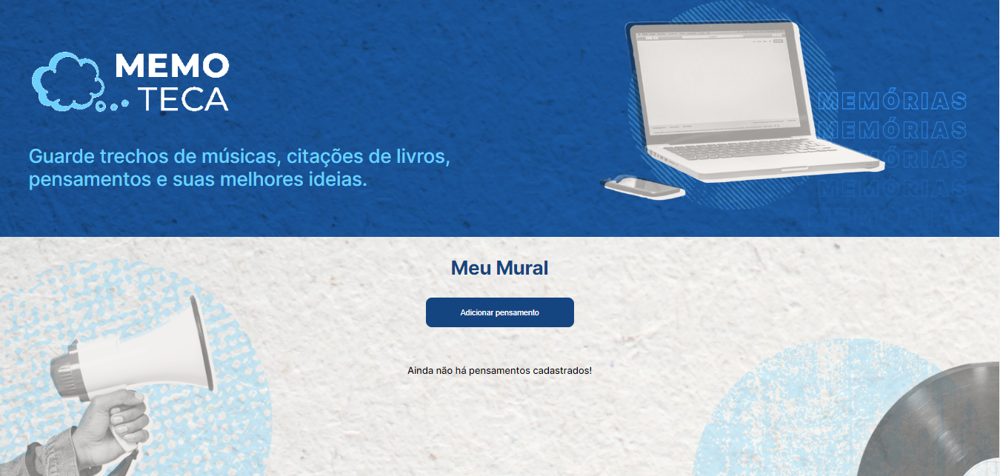
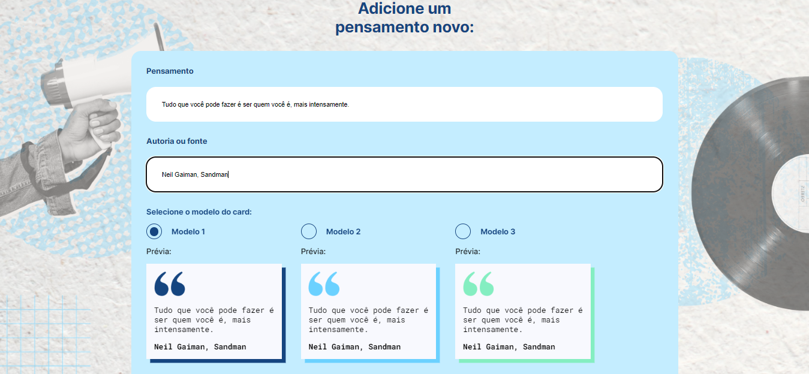
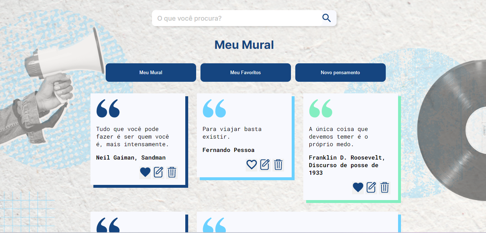
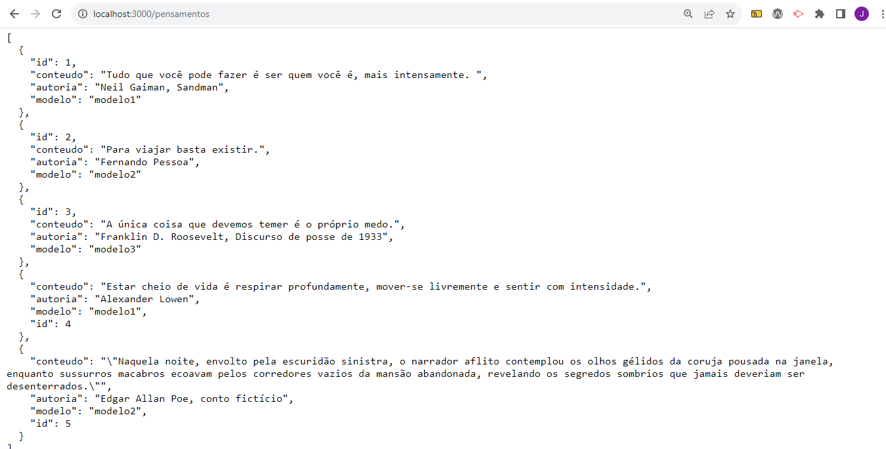

# Memoteca

Projeto do curso Explorando os conceitos do <b>Angular</b> da <b>ALura</b>. Onde foi abordado os principais conceitos do framework, criando uma aplicação tipo bloco de notas para guardar trechos de músicas, citações de livros, pensamentos e melhores ideias. 

## Tecnologias utilizadas no projeto
* Angular
* Json Server
* HTML
* CSS
* JavaScript
* TypeScript

<h3>Contribuindo</h3>

⭐️ Star o projeto

🐛 Encontrar e relatar issues
