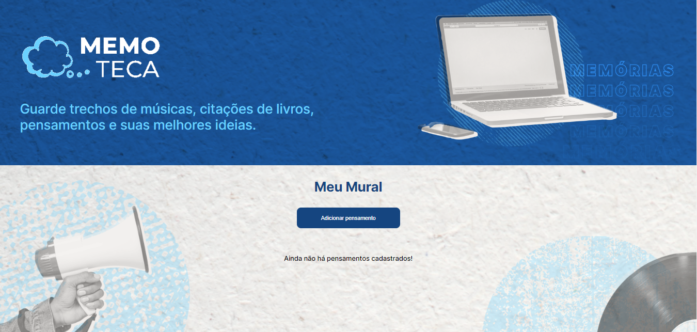
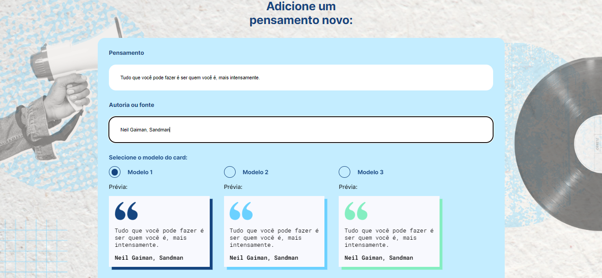
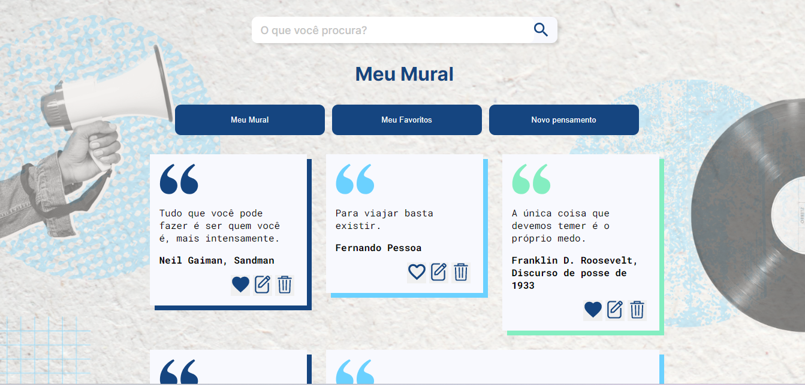
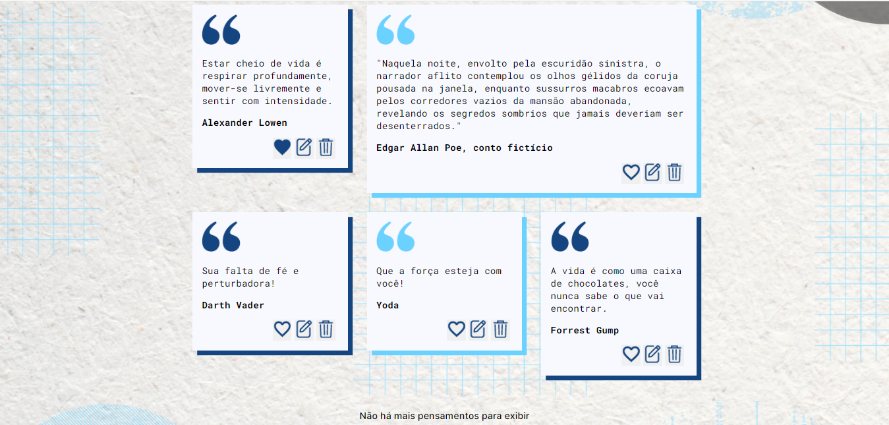
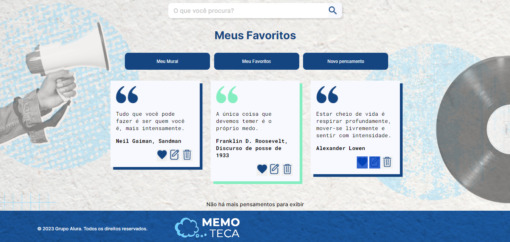
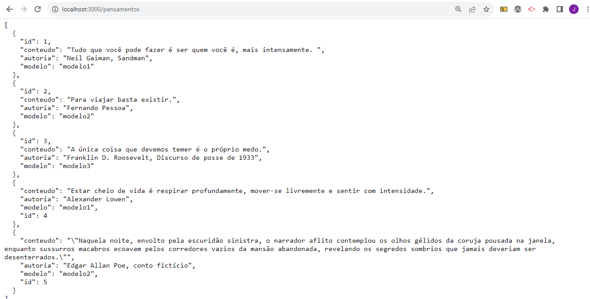

# Memoteca

Projeto do curso Criando uma aplicação <b>Angular CLI</b> da <b>ALura</b>. Onde foi abordado os principais conceitos do framework, criando uma aplicação tipo bloco de notas para guardar trechos de músicas, citações de livros, pensamentos e melhores ideias.

## Tópicos abordados durante esse projeto:
* Criação do Projeto com angular CLI
* Instalando json-server para simular uma API RESTful
* Construindo a estrutura de um componente (Mural)
* Adicionando Filtros na busca dos materiais
* Persistência da lista de favoritos em LocalStorage

## Tecnologias utilizadas no projeto
* Angular
* Json Server
* HTML
* CSS
* JavaScript
* TypeScript

<h3>Contribuindo</h3>

⭐️ Star o projeto

üêõ Encontrar e relatar issues
